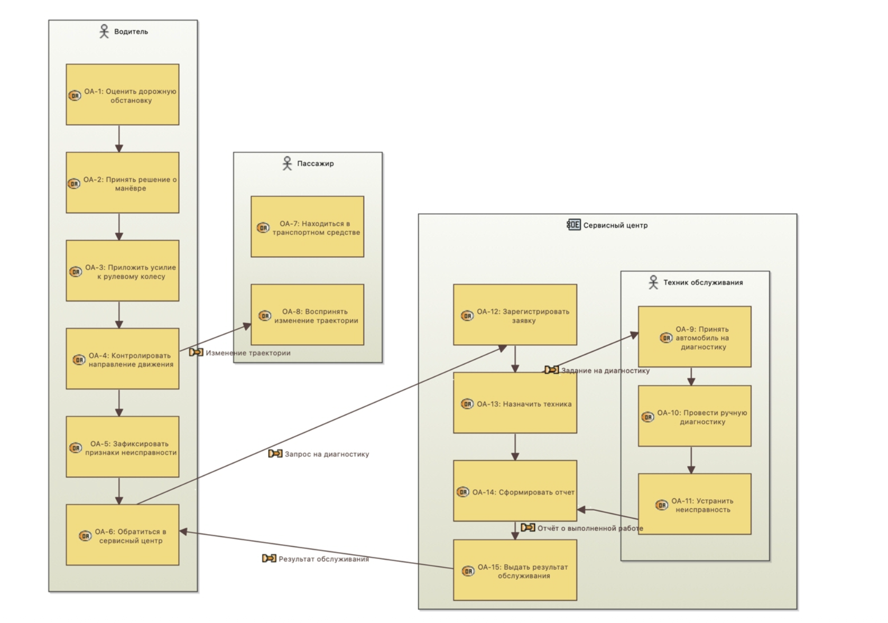
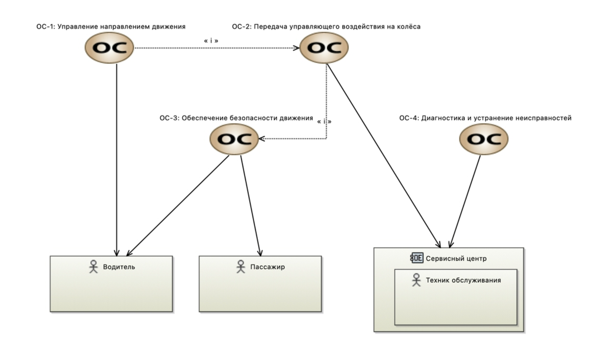
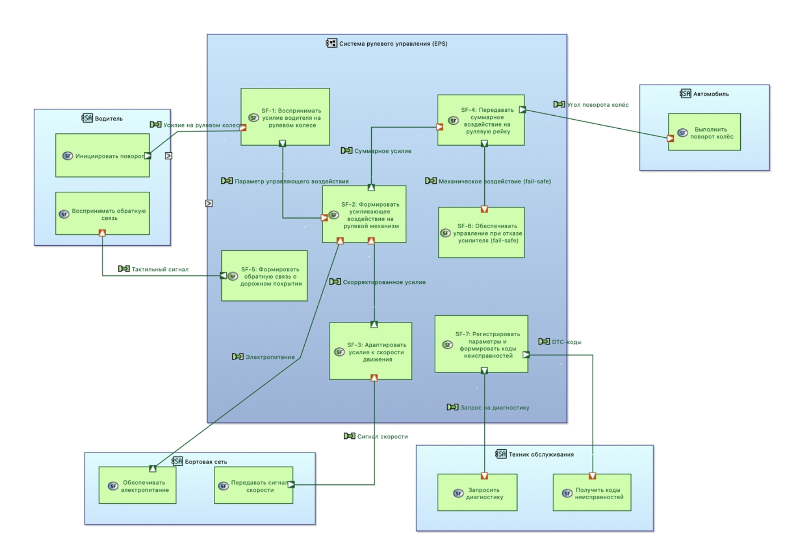
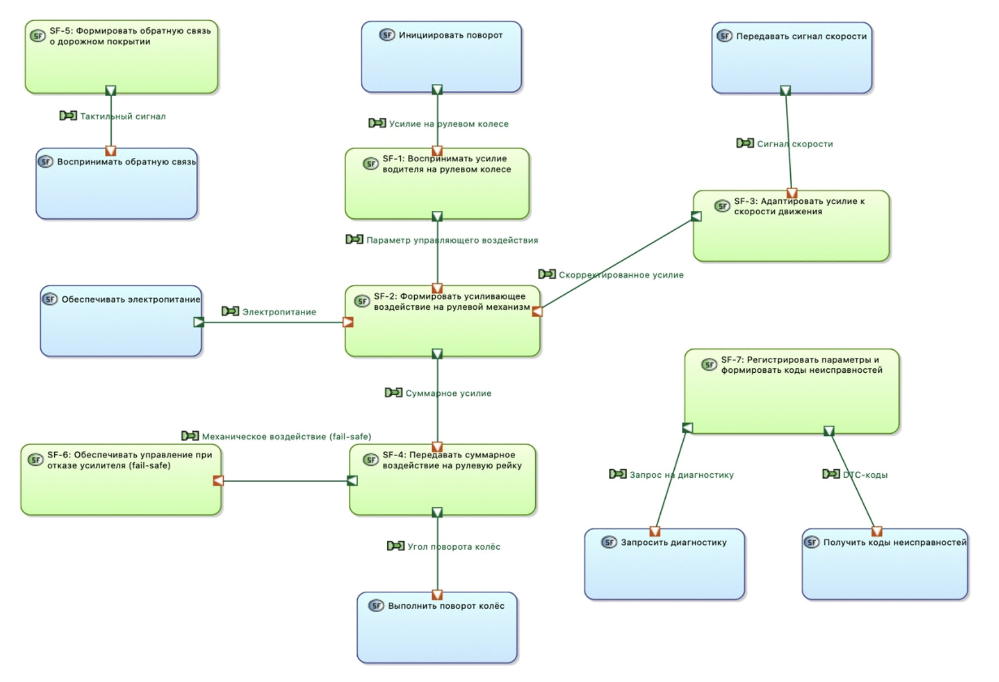
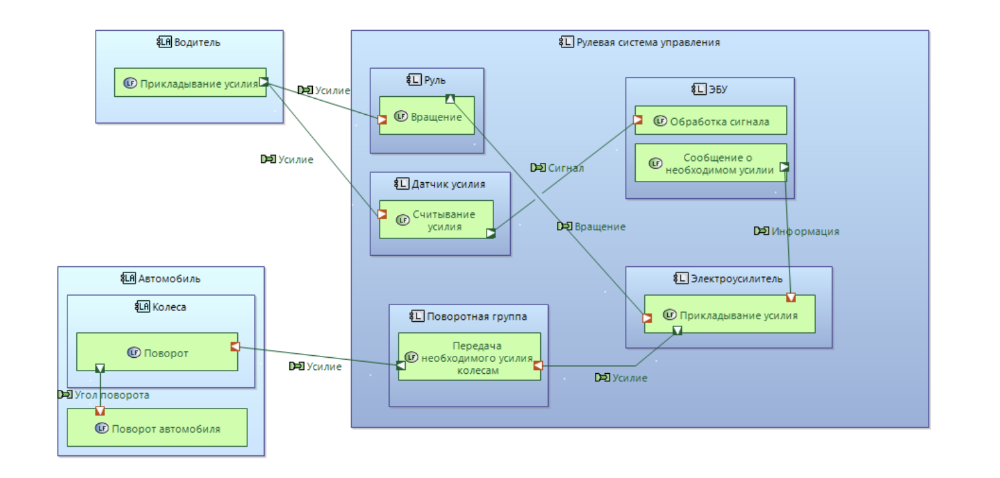
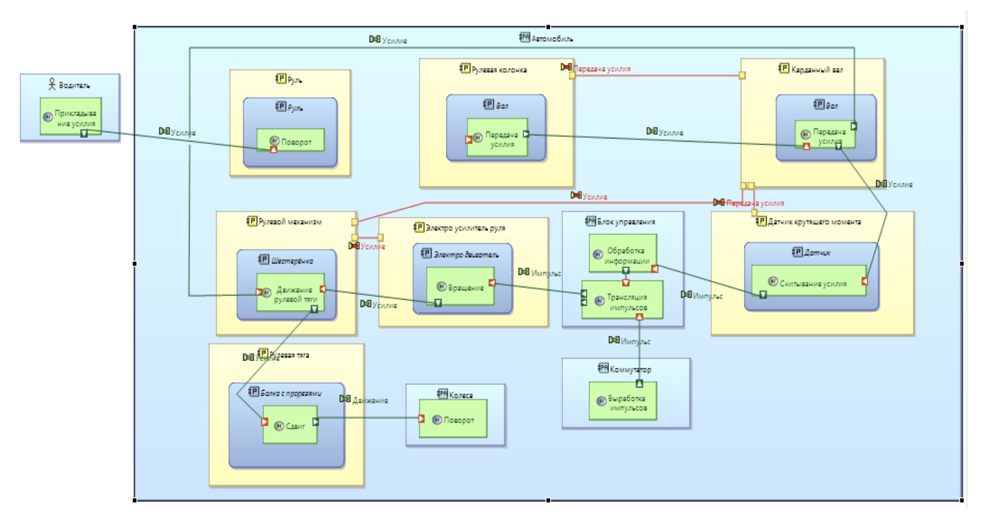

# Архитектурная модель системы электроусилителя руля (EPS)

**Автор:** Денис Шендаков, студент РТУ МИРЭА (Системный анализ и управление)
**Методология:** ARCADIA / MBSE
**Инструменты:** Eclipse Capella, Python (для имитационного моделирования)

📄 **Полный текст исследования, спецификации и матрицы трассировки доступны в документе:** [`docs/КР_Отсиса_Шендаков.pdf`](./docs/КР_Отсиса_Шендаков.pdf)

## Описание проекта
Проект представляет собой полный цикл системного анализа и проектирования архитектуры электроусилителя руля (EPS) для легкового автомобиля. Разработка выполнена на четырёх уровнях абстракции по методологии ARCADIA, от анализа операционных потребностей до физической реализации и программной верификации требований.

## 1. Операционный анализ (AS IS)
На первом этапе проанализирован существующий процесс управления направлением движения автомобиля, выявлены проблемы (высокое физическое усилие, отсутствие объективной диагностики) и определены операционные сущности[cite: 1].

**Диаграмма операционной деятельности (OAB):**
Показывает распределение действий между водителем, пассажиром и техником сервисного центра[cite: 1].

**Диаграмма операционных способностей (OCB):**
Определяет ключевые способности процесса, такие как передача управляющего воздействия и диагностика[cite: 1].

## 2. Анализ назначения системы (System Needs Analysis)
Система рассмотрена как «чёрный ящик». Определены её миссии, функции и границы взаимодействия с внешним миром[cite: 1]. 

**Диаграмма системного контекста (SAB):**
Отображает интерфейсы взаимодействия EPS с водителем, бортовой сетью, рулевым механизмом и техником[cite: 1].

**Диаграмма потоков данных между системными функциями (SDFB):**
Описывает логику передачи сигналов (усилие, скорость, тактильная отдача) без привязки к внутреннему устройству[cite: 1].

## 3. Логическая архитектура (Logical Architecture)
Система декомпозирована на 5 логических компонентов (модули восприятия, обработки, усиления, передачи и диагностики) для реализации системных функций[cite: 1].

**Диаграмма логической архитектуры (LAB):**
Показывает внутреннюю структуру системы и обмен данными между логическими модулями[cite: 1].

## 4. Физическая архитектура (Physical Architecture)
Логические компоненты распределены по 6 конкретным физическим узлам (датчики, ЭБУ, двигатель PMSM, рейка, блок диагностики)[cite: 1].

**Диаграмма физической архитектуры (PAB):**
Финальная схема реализации системы с указанием аппаратных компонентов и физических связей[cite: 1].

## 5. Верификация требований
Разработана имитационная модель на языке Python (`eps_verification.py`) для проверки ключевых требований (SyR-1, SyR-2, SyR-4, SyR-5, SyR-6, SyR-9)[cite: 1]. 
Моделирование включало 3 сценария (парковка, высокая скорость, отказ усилителя). По результатам пакетного прогона архитектура подтвердила 100% успешность (Pass rate) по всем проверяемым метрикам[cite: 1].

---
📄 **Полный текст исследования, спецификации и матрицы трассировки доступны в документе:** [`docs/КР_Отсиса_Шендаков.pdf`](./docs/КР_Отсиса_Шендаков.pdf)
